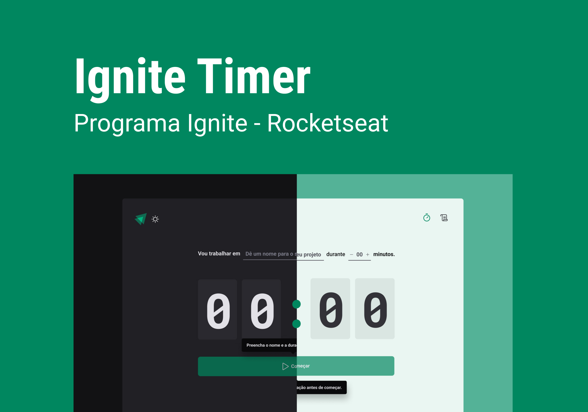
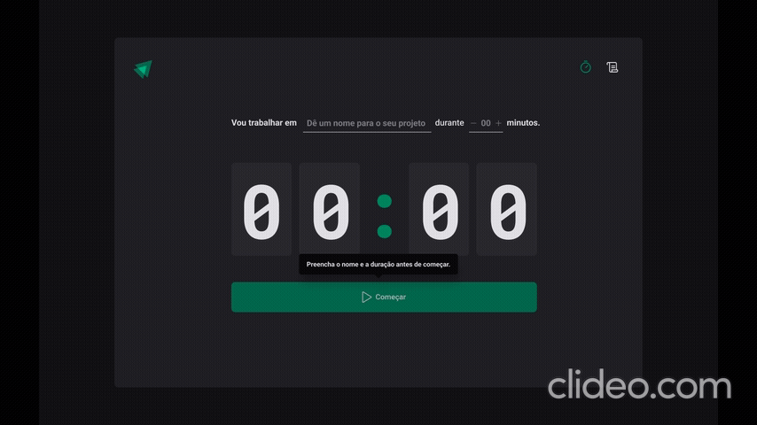

# Ignite Feed
[](#)
***Ignite Timer is a Pomodoro application***

I used this project to study **React JS** concepts like **Hooks** **useContext**, **useReducer** and **useEffect**. In addition to learning about **forms** and **immutability** with the **React Hook Form**, **Zod** and **Immer** libraries. I too learned styling concepts using the **Styled Components** library along with **Typescript**.

> Status: Finished... ✅

## Technologies 🚀


## Libs 📕

📑 **REACT HOOK FORM**

📑 **ZOD**

📑 **DATE-FNS**

📑 **IMMER**

📑 **PHOSPHOR ICONS**

📑 **ESLINT**

## Features 💡

✅ **ADD PROJECT**

✅ **SET POMODORO**

✅ **STOP POMODORO**

✅ **VIEW HISTORY OF POMODOROS**

## How do use the project ⚙️

### 1. Clone repository
```sh
git clone https://github.com/reinheimermat/ignite-timer
```
### 2. Install dependencies
```sh
npm install
```

### 3. Run local project
```sh
npm run dev
```
### 4. Access the project
```sh
http://localhost:5173/
```

## License 📝

[](https://github.com/Ileriayo/markdown-badges/blob/master/LICENSE)

## LINKS 🔗

[](https://www.linkedin.com/in/reinheimermat/)
[](mailto:contatoreinheimer@gmail.com)

<center></center>